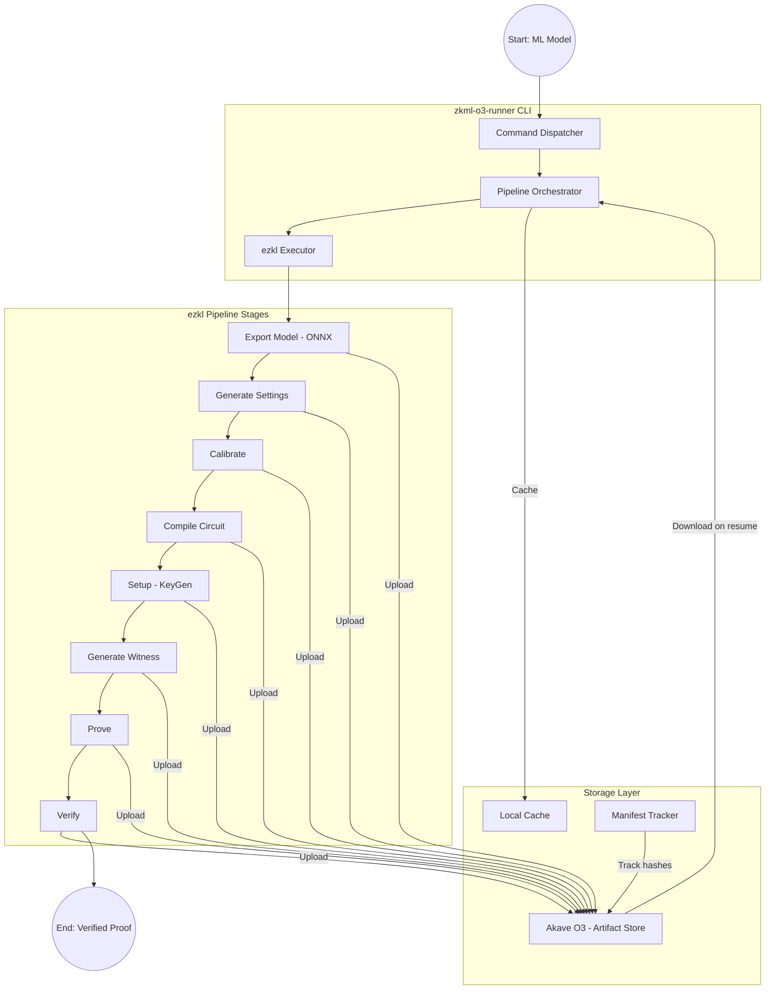
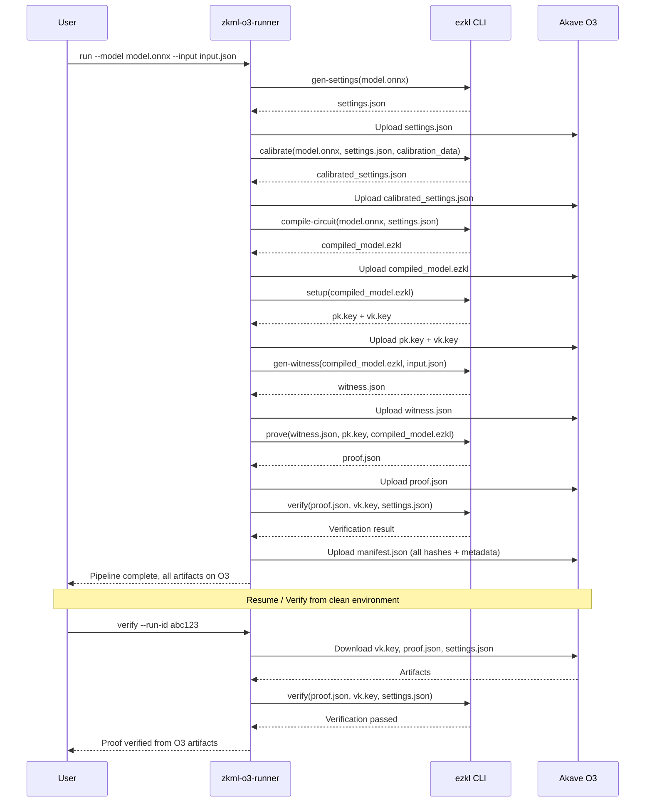

# ZKML Workflows on Akave O3: Detailed Technical Plan & Milestones

**Status**: Ready for review
**Contributor**: Patrick-Ehimen
**Date**: February 10, 2026
**Proposal Reference**: [PROPOSAL.md](./PROPOSAL.md)
**Note:** Open for potential collaborators

**A CLI-driven workflow runner that executes ezkl zero-knowledge ML pipelines, stores all intermediate artifacts (models, circuits, keys, proofs) in Akave O3 with structured naming and manifest tracking, and enables reproducible verification and mid-stage resume from any clean environment.**

## Brief Problem Statement

Zero-knowledge machine learning (ZKML) pipelines produce and consume large artifacts across multiple stages — model formats, compiled circuits, proving/verification keys, proofs, witness data, and calibration outputs. Today these are stored locally or in centralized object stores, causing:

- **Fragile workflows** — local-only artifacts, poor portability across machines
- **Hard-to-reproduce builds** — missing or version-mismatched artifacts break verification
- **Limited collaboration** — sharing proofs, keys, and intermediate outputs requires manual coordination
- **No audit trail** — no immutable record of which artifacts produced which proofs

> There is a clear need for a **structured, immutable, and shareable** artifact store that makes ZKML workflows reproducible and collaborative — validating **Akave O3** for this use case.

## Objective

Build an integration project that validates Akave O3 as a storage backend for ezkl-based ZKML workflows:

1. **Execute** ezkl pipeline stages (model prep → compile → keygen → prove → verify)
2. **Store** all artifacts in Akave O3 with structured naming and metadata manifests
3. **Resume** pipelines mid-stage by fetching prerequisites from O3
4. **Verify** proofs in clean environments using only O3-stored artifacts
5. **Test** deterministic, repeatable runs via automated CI

## Platform Architecture



## Stage-by-Stage Artifact Flow



## High-Level Architecture

### Pipeline Orchestrator

**The core component that sequences ezkl stages, manages artifact dependencies between stages, and coordinates uploads/downloads with Akave O3.**

**Core Capabilities:**

- **Stage Sequencing** — Executes ezkl commands in the correct order, passing outputs as inputs to subsequent stages
- **Dependency Resolution** — Before running a stage, checks if prerequisites exist locally or fetches them from O3
- **Resume Support** — Can start from any mid-stage if prior artifacts are available on O3
- **Stage Tracking** — Records which stages have completed, enabling partial re-runs and incremental pipelines

**ezkl Pipeline Stages and Artifacts:**

| Stage | ezkl Command | Input Artifacts | Output Artifacts |
|-------|-------------|-----------------|------------------|
| **Export** | (pre-step) | PyTorch/TF model | `model.onnx`, `input.json` |
| **Settings** | `gen-settings` | `model.onnx` | `settings.json` |
| **Calibrate** | `calibrate-settings` | `model.onnx`, `settings.json`, calibration data | `settings.json` (updated) |
| **Compile** | `compile-circuit` | `model.onnx`, `settings.json` | `compiled_model.ezkl` |
| **Setup** | `setup` | `compiled_model.ezkl` | `pk.key`, `vk.key` |
| **Witness** | `gen-witness` | `compiled_model.ezkl`, `input.json` | `witness.json` |
| **Prove** | `prove` | `witness.json`, `pk.key`, `compiled_model.ezkl` | `proof.json` |
| **Verify** | `verify` | `proof.json`, `vk.key`, `settings.json` | verification result |

### Akave O3 Client Wrapper

**A Go wrapper around the Akave O3 SDK/API that handles artifact upload/download with retry logic, hash verification, and local caching.**

**Core Capabilities:**

- **Upload with Retry** — Exponential backoff on transient failures
- **Hash Verification** — SHA-256 checksum computed pre-upload, verified post-download to ensure artifact integrity
- **Local Caching** — Downloaded artifacts cached locally to avoid redundant fetches within the same session
- **Multipart Upload** — Support for large artifacts (proving keys can be 100MB+)

### Manifest Tracker

**Tracks all artifacts produced during a pipeline run with cryptographic hashes, ezkl version, and execution metadata — enabling reproducibility audits.**

**Manifest Schema (`manifest.json`):**

```json
{
  "project_id": "my-zkml-project",
  "run_id": "run-20260210-abc123",
  "ezkl_version": "12.0.0",
  "created_at": "2026-02-10T14:30:00Z",
  "model": {
    "name": "mnist-small",
    "framework": "pytorch",
    "parameters": 12000
  },
  "stages": {
    "gen_settings": { "status": "completed", "timestamp": "...", "duration_ms": 450 },
    "calibrate": { "status": "completed", "timestamp": "...", "duration_ms": 2100 },
    "compile": { "status": "completed", "timestamp": "...", "duration_ms": 8500 },
    "setup": { "status": "completed", "timestamp": "...", "duration_ms": 15000 },
    "gen_witness": { "status": "completed", "timestamp": "...", "duration_ms": 300 },
    "prove": { "status": "completed", "timestamp": "...", "duration_ms": 45000 },
    "verify": { "status": "completed", "timestamp": "...", "duration_ms": 200 }
  },
  "artifacts": {
    "model.onnx": { "o3_key": "projects/.../models/model.onnx", "sha256": "abc123...", "size_bytes": 48000 },
    "settings.json": { "o3_key": "projects/.../circuits/settings.json", "sha256": "def456...", "size_bytes": 1200 },
    "compiled_model.ezkl": { "o3_key": "projects/.../circuits/compiled_model.ezkl", "sha256": "ghi789...", "size_bytes": 5200000 },
    "pk.key": { "o3_key": "projects/.../keys/pk.key", "sha256": "jkl012...", "size_bytes": 102400000 },
    "vk.key": { "o3_key": "projects/.../keys/vk.key", "sha256": "mno345...", "size_bytes": 2048 },
    "witness.json": { "o3_key": "projects/.../proofs/witness.json", "sha256": "pqr678...", "size_bytes": 8400 },
    "proof.json": { "o3_key": "projects/.../proofs/proof.json", "sha256": "stu901...", "size_bytes": 15000 }
  },
  "input_hash": "vwx234...",
  "command_sequence": [
    "ezkl gen-settings -M model.onnx -O settings.json",
    "ezkl calibrate-settings -M model.onnx -D calibration.json --target settings.json",
    "ezkl compile-circuit -M model.onnx -S settings.json --compiled-circuit compiled_model.ezkl",
    "ezkl setup --compiled-circuit compiled_model.ezkl --pk-path pk.key --vk-path vk.key",
    "ezkl gen-witness --compiled-circuit compiled_model.ezkl -D input.json -O witness.json",
    "ezkl prove --witness witness.json --pk-path pk.key --compiled-circuit compiled_model.ezkl --proof-path proof.json",
    "ezkl verify --proof-path proof.json --vk-path vk.key --settings-path settings.json"
  ]
}
```

### Artifact Storage Layout (Akave O3)

```
zkml-o3/
├── projects/
│   └── <project_id>/
│       └── runs/
│           └── <run_id>/
│               ├── manifest.json
│               ├── inputs/
│               │   ├── input.json
│               │   └── calibration.json
│               ├── models/
│               │   └── model.onnx
│               ├── circuits/
│               │   ├── settings.json
│               │   └── compiled_model.ezkl
│               ├── keys/
│               │   ├── pk.key
│               │   └── vk.key
│               └── proofs/
│                   ├── witness.json
│                   └── proof.json
└── index/
    └── projects.json        (list of all projects and latest run IDs)
```

## Approach

We will build the zkml-o3-runner in **incremental milestones**, starting with O3 connectivity and a minimal single-stage pipeline, then expanding to the full ezkl workflow with resume support, and finally adding CI and documentation.

### Implementation Strategy

1. **Core infrastructure** — Project scaffold, O3 client wrapper, config management
2. **Pipeline orchestrator** — Full ezkl pipeline with artifact upload after each stage
3. **Resume & verification** — Mid-stage resume from O3, clean-room verification flow
4. **Reference examples & CI** — Example models, automated tests, CI pipeline
5. **Hardening & documentation** — Error handling, manifest tracking, comprehensive docs

### Akave O3 Integration

Akave O3 serves as the **immutable artifact store**. We use the Akave O3 SDK/API for object operations:

- `Upload` — Store artifacts after each pipeline stage with hash verification
- `Download` — Fetch prerequisites when resuming or verifying in a clean environment
- `List` — Browse project runs and their artifacts

> **Note:** All ezkl execution happens locally. O3 is purely the persistence and sharing layer.

---

## Complete End-to-End Workflow

### Full Pipeline Run (Cold Start)

1. **User Invokes Pipeline**
   - `zkml-o3-runner run --project my-project --model model.onnx --input input.json`
   - Runner creates a new `run_id`, initializes manifest

2. **Stage Execution Loop**
   - For each stage (settings → calibrate → compile → setup → witness → prove → verify):
     - Check if input artifacts exist locally, otherwise fetch from O3
     - Execute the ezkl command
     - Compute SHA-256 hash of output artifact
     - Upload output to O3 under `projects/<project_id>/runs/<run_id>/<category>/`
     - Update manifest with stage status, hash, and timing

3. **Finalization**
   - Upload completed `manifest.json` to O3
   - Log summary: all artifact O3 keys, total duration, verification result

### Resume from Mid-Stage

1. **User Resumes**
   - `zkml-o3-runner resume --project my-project --run-id abc123 --from prove`
   - Runner downloads manifest from O3, identifies required artifacts for the `prove` stage

2. **Artifact Fetch**
   - Downloads `compiled_model.ezkl`, `pk.key`, `witness.json` from O3
   - Verifies SHA-256 hashes against manifest

3. **Continue Pipeline**
   - Executes `prove` and `verify` stages
   - Uploads new artifacts, updates manifest

### Clean-Room Verification

1. **Verifier Fetches Artifacts**
   - `zkml-o3-runner verify --project my-project --run-id abc123`
   - Downloads only what's needed: `proof.json`, `vk.key`, `settings.json`

2. **Verification**
   - Runs `ezkl verify` with downloaded artifacts
   - Reports pass/fail with hash verification

**CLI Command Examples:**

```bash
# Full pipeline run
zkml-o3-runner run --project mnist-demo --model models/mnist.onnx --input data/input.json

# List runs for a project
zkml-o3-runner list --project mnist-demo

# Resume from a specific stage
zkml-o3-runner resume --project mnist-demo --run-id run-20260210-abc123 --from prove

# Verify a proof from O3 (clean environment)
zkml-o3-runner verify --project mnist-demo --run-id run-20260210-abc123

# Download all artifacts for a run
zkml-o3-runner download --project mnist-demo --run-id run-20260210-abc123 --output ./artifacts/
```

---

## Milestones

### Milestone 1: Project Scaffolding & O3 Client

**Goal**: Set up the project, implement the Akave O3 client wrapper, and verify basic upload/download of test artifacts.

- [ ] Initialize Go module (`zkml-o3`) with project directory structure
- [ ] Set up `Makefile` with targets: `build`, `test`, `lint`, `run`
- [ ] Implement config loading (YAML + env vars) for O3 credentials and ezkl binary path
- [ ] Implement Akave O3 client wrapper:
  - [ ] `Upload(bucket, key, data)` with retry/backoff
  - [ ] `Download(bucket, key)` with local caching
  - [ ] `List(bucket, prefix)` for browsing artifacts
  - [ ] SHA-256 hash verification pre/post transfer
- [ ] Implement the artifact storage layout naming convention
- [ ] Unit tests for O3 client with mocked responses
- [ ] Integration test: upload and download a test file to/from Akave O3
- [ ] Verify ezkl binary is accessible and callable from Go (`os/exec`)

**Deliverables:**
- Buildable Go project with working O3 client
- Verified upload/download to Akave O3 with hash integrity
- ezkl binary invocable from the runner
- Unit tests passing

**Acceptance Criteria:**
- `make build` compiles without errors
- A test file uploaded to O3 can be downloaded and hash-verified
- ezkl CLI is callable and returns version info
- O3 client retries on transient failures (tested with injected errors)

---

### Milestone 2: Pipeline Orchestrator & Full ezkl Workflow

**Goal**: Implement the pipeline orchestrator that runs the full ezkl workflow end-to-end, uploading each artifact to O3 after every stage.

- [ ] Implement stage executor: wrapper around `ezkl` CLI commands via `os/exec`
- [ ] Implement pipeline orchestrator with stage sequencing:
  - [ ] `gen-settings` → `calibrate-settings` → `compile-circuit` → `setup` → `gen-witness` → `prove` → `verify`
- [ ] Implement artifact dependency resolution (each stage knows its inputs and outputs)
- [ ] Upload output artifacts to O3 after each stage completes
- [ ] Implement `manifest.json` generation with:
  - [ ] Artifact hashes, O3 keys, sizes
  - [ ] ezkl version, model metadata
  - [ ] Stage statuses, timestamps, durations
  - [ ] Full command sequence
- [ ] Upload manifest to O3 on pipeline completion
- [ ] Implement `run` CLI command: `zkml-o3-runner run --project <name> --model <path> --input <path>`
- [ ] Test with a small model (e.g., simple MNIST or a 2-layer perceptron)
- [ ] Verify all artifacts appear on O3 with correct structure

**Deliverables:**
- Full ezkl pipeline runs end-to-end via the CLI
- All artifacts uploaded to O3 after each stage
- Manifest tracks every artifact with hashes and metadata
- Working with at least one reference model

**Acceptance Criteria:**
- `zkml-o3-runner run` executes all stages and produces a valid proof
- All artifacts present on O3 under `projects/<id>/runs/<id>/` with correct layout
- Manifest contains accurate hashes for all artifacts
- `ezkl verify` passes at the end of the pipeline

---

### Milestone 3: Resume & Clean-Room Verification

**Goal**: Enable mid-stage resume by fetching artifacts from O3, and support clean-room proof verification using only O3-stored artifacts.

- [ ] Implement `resume` CLI command: `zkml-o3-runner resume --project <name> --run-id <id> --from <stage>`
  - [ ] Download manifest from O3
  - [ ] Identify required artifacts for the target stage
  - [ ] Download and hash-verify each artifact
  - [ ] Execute pipeline from the specified stage onward
  - [ ] Upload new artifacts and update manifest
- [ ] Implement `verify` CLI command: `zkml-o3-runner verify --project <name> --run-id <id>`
  - [ ] Download only `proof.json`, `vk.key`, `settings.json` from O3
  - [ ] Verify artifact hashes against manifest
  - [ ] Run `ezkl verify` and report result
- [ ] Implement `list` CLI command: list projects and runs
- [ ] Implement `download` CLI command: download all artifacts for a run
- [ ] Test resume flow: run pipeline, delete local artifacts, resume from mid-stage using O3
- [ ] Test clean-room verification: fresh environment, verify proof using only O3 artifacts
- [ ] Test integrity: tamper with an artifact, verify that hash check catches it

**Deliverables:**
- Resume from any pipeline stage using O3 artifacts
- Clean-room verification working with O3-only artifacts
- CLI commands: `run`, `resume`, `verify`, `list`, `download`
- Integrity verification via SHA-256 hash checks

**Acceptance Criteria:**
- After deleting all local artifacts, `resume --from prove` downloads prerequisites from O3 and completes the pipeline
- In a clean directory with no prior artifacts, `verify` downloads from O3 and confirms the proof
- Tampering with an artifact on disk causes hash verification to fail with a clear error
- `list` shows all projects and runs with timestamps

---

### Milestone 4: Reference Examples & CI

**Goal**: Provide reference model examples, automated tests, and a CI pipeline that validates the full workflow.

- [ ] Create reference examples with small models:
  - [ ] `examples/mnist/` — simple MNIST classifier (PyTorch → ONNX → ezkl)
  - [ ] `examples/linear/` — minimal linear model for fast CI runs
- [ ] Include model export scripts (`export_model.py`) to generate ONNX + sample inputs
- [ ] Automated test suite:
  - [ ] **Cold-start test**: run full pipeline, verify all artifacts on O3
  - [ ] **Clean-room test**: fresh environment downloads and verifies proof from O3
  - [ ] **Resume test**: delete local outputs, resume from mid-stage, verify completion
  - [ ] **Integrity test**: corrupt an artifact, verify hash check catches it
- [ ] CI pipeline (GitHub Actions):
  - [ ] Install ezkl + Go dependencies
  - [ ] Run linting and unit tests
  - [ ] Execute full pipeline with minimal model
  - [ ] Upload artifacts to test O3 bucket
  - [ ] Re-download and verify in a clean step
  - [ ] Cleanup test bucket (optional)
- [ ] Test with model export → full pipeline → verification in a single CI run

**Deliverables:**
- 2 reference example models with export scripts
- Automated test suite covering all 4 test scenarios
- CI pipeline running end-to-end on every push
- Test results and artifact inspection in CI logs

**Acceptance Criteria:**
- CI pipeline passes end-to-end with the minimal linear model
- All 4 test scenarios (cold-start, clean-room, resume, integrity) pass
- Reference examples include clear README with instructions
- CI runtime stays under 10 minutes with minimal models

---

### Milestone 5: Hardening & Documentation

**Goal**: Add error handling, observability, and comprehensive documentation for users and contributors.

- [ ] Add structured error handling for all failure modes:
  - [ ] ezkl command failures (non-zero exit, stderr parsing)
  - [ ] O3 upload/download failures (retry exhaustion)
  - [ ] Hash verification mismatches
  - [ ] Missing prerequisites for a stage
- [ ] Add structured logging (`zerolog`) with levels: debug (artifact hashes, byte counts), info (stage start/complete), error (failures with context)
- [ ] Add progress reporting for long stages (compile, setup, prove)
- [ ] Add `--dry-run` flag to show what would be executed without running ezkl
- [ ] Add `--verbose` flag for detailed output
- [ ] Write documentation:
  - [ ] **Setup Guide**: prerequisites (ezkl, Go, O3 credentials), installation, configuration
  - [ ] **Usage Guide**: CLI commands with examples, typical workflows
  - [ ] **Reproduce a Run**: step-by-step for downloading and verifying from O3
  - [ ] **Artifact Reference**: storage layout, manifest schema, supported artifact types
  - [ ] **Extending Guide**: how to add new model types, custom stages, or alternative ZK frameworks
- [ ] Finalize README with quickstart and architecture overview
- [ ] Review and clean up all code, ensure consistent error handling and naming

**Deliverables:**
- Robust error handling for all failure modes
- Structured logging with configurable verbosity
- Complete documentation suite
- Polished README with quickstart

**Acceptance Criteria:**
- ezkl failure at any stage produces a clear, actionable error message
- O3 failures retry and report after exhaustion
- Documentation sufficient for a new user to install, run a pipeline, and verify a proof
- `--dry-run` accurately shows the planned execution without side effects
- README quickstart works from a fresh clone

---

## Milestone Summary

| Milestone | Focus | Key Outcome |
|-----------|-------|-------------|
| **M1** | Project Scaffolding & O3 Client | O3 upload/download working, ezkl callable |
| **M2** | Pipeline Orchestrator & Full Workflow | End-to-end ezkl pipeline with all artifacts on O3 |
| **M3** | Resume & Clean-Room Verification | Mid-stage resume + verification from O3-only artifacts |
| **M4** | Reference Examples & CI | Example models, automated tests, CI pipeline |
| **M5** | Hardening & Documentation | Error handling, logging, comprehensive docs |

## Tech Stack

| Layer | Stack |
|-------|-------|
| **Language** | Go 1.22+ |
| **ZK Framework** | ezkl (CLI, latest stable) |
| **Model Format** | ONNX (exported from PyTorch) |
| **Storage** | Akave O3 |
| **Hashing** | SHA-256 (crypto/sha256) |
| **Config** | Viper (YAML + env) |
| **Logging** | zerolog |
| **CLI Framework** | cobra |
| **CI** | GitHub Actions |
| **Model Export** | Python (PyTorch + ONNX) |

**Key deps:** `akave-o3-sdk`, `spf13/cobra`, `spf13/viper`, `rs/zerolog`

## Project Layout

```
zkml-o3/
├── cmd/
│   └── zkml-o3-runner/       # CLI entrypoint (main.go)
├── internal/
│   ├── pipeline/             # Pipeline orchestrator, stage sequencing
│   ├── stages/               # Individual stage executors (gen-settings, compile, prove, etc.)
│   ├── storage/              # Akave O3 client wrapper
│   ├── manifest/             # Manifest generation and parsing
│   ├── cache/                # Local artifact cache
│   └── config/               # Config loading
├── examples/
│   ├── mnist/                # MNIST reference model + export script
│   │   ├── export_model.py
│   │   ├── model.onnx
│   │   └── input.json
│   └── linear/               # Minimal model for fast CI
│       ├── export_model.py
│       ├── model.onnx
│       └── input.json
├── tests/                    # Integration + e2e tests
├── docs/                     # Setup, usage, artifact reference
├── configs/                  # YAML config templates
├── Makefile
├── PLAN.md
├── PROPOSAL.md
└── README.md
```

## Dependencies & Risks

### External Dependencies
- **ezkl CLI** — Must be installed and accessible; version changes may alter artifact formats or command flags
- **Akave O3 SDK/API** — Access to O3 storage; SDK changes may require wrapper updates
- **PyTorch + ONNX** — For model export in reference examples (Python dependency, not in the Go runner itself)

### Risks & Mitigations

| Risk | Impact | Mitigation |
|------|--------|------------|
| ezkl CLI version changes break command flags | Medium | Pin ezkl version in manifest; abstract CLI invocation behind stage executor |
| Large artifacts (proving keys ~100MB+) slow upload | Medium | Multipart upload support; compress where applicable |
| ezkl proving takes too long for CI | Medium | Use minimal models (linear, 2-layer) for CI; larger models for manual testing |
| Akave O3 API changes | Low | Wrapper layer abstracts O3 interactions; pinned SDK version |
| Non-deterministic ezkl outputs across versions | High | Lock ezkl version per project; hash-verify all artifacts; document version requirements |

## Success Criteria

- End-to-end ezkl workflow completes with **all artifacts stored in O3**
- Proof verification succeeds in a **clean environment** using only O3 artifacts
- Workflow can **resume mid-stage** using downloaded artifacts
- Manifest provides a **complete audit trail** of artifacts, hashes, and commands
- Tests pass reliably and are **documented well enough for new contributors**
- Demonstrates Akave O3 as a **reproducibility and collaboration layer** for ZKML pipelines

## References

- **ezkl**: https://github.com/zkonduit/ezkl
- **ezkl Documentation**: https://docs.ezkl.xyz/
- **Akave O3 Console**: https://console.akave.ai/
- **ONNX**: https://onnx.ai/
- **PyTorch**: https://pytorch.org/
